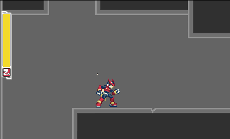
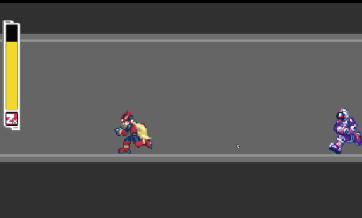
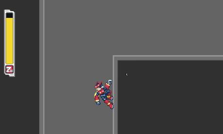
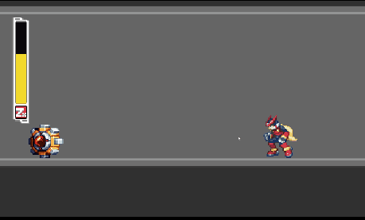

## Description

A fun project I made as I learn to use Unity and exlore its features. I have always been a fan of the MMZ series because of its artstyle, fluid movement and how crispy the control feels. The idea was to capture that control feel as much as possible in Unity2D rather than recreating the actual game. The original game isn't the most physically accurate so the physics simulation actually often gets in the way. Since I used a Rigidbody2D for the player controller, quite a bit of tweaking needs to be done to make it "less realistic" to achive a feel similar to the original game. The player's sprite is actually from ZX but that's only because I really like the purple Z Saber. The combat is still based on the Zero games.

I initially tought about recreating an entire stage from the original game but couldn't find the sprites. Then I thought since the focus was really on recreating the movements, I might as well just draw some tilesets and make my own level. It's mostly just simple blocks due to my lack of drawing skill but I tried to make it feel somewhat self-contained and have some verticality like how those metroidvania maps would play like.

The player character will slide on slopes due to physics simulation. One way I can think of to stop that is to do a raycast downwards and get the normal of the surface to see if the character is on a slope, and then restrict movements on x axis. 

For transition between scenes I simply used a static class to perserve necessary data like player's health and spawn position. 

### Control:
| Key | Action |
| ------ | ----------- |
| Arrow keys   | Run |
|LShift| Dash(Hold to dash longer)|
|Space| Jump(Hold to jump higher)|
|Arrow while touching wall| Wall slide|
| Z  | Slash (can combo up to 3 hits)|
| Z while wall sliding  |Wall Slash|
|Z while dashing| Dash Slash|
|Z while airborne| Air Slash|
|Down+Z while airborne| Circling slash|

### What's achieved so far
- Variable length dashing and jumping
- Afterimage when dashing
- All the sword slash moves from the original game (triple slash combo, circling slash etc.)
- Wall movements (sliding, jumping, slashing)
- Enemies AIs using FSM
- Collectible items
- A simple level that involves a bit of backtracking

### Todo
- Fix some broken wall interactions
- Add an input buffer for wall jumping
- Try using Unity's new input system
- Clean up the player states transitions a bit
- Maybe add a boss fight
- Sound effects

 \
 \
 \
 \

## References:
Player sprite: \
https://www.spriters-resource.com/ds_dsi/megamanzx/sheet/83/
\
Item sprite:\
https://www.spriters-resource.com/ds_dsi/megamanzx/sheet/52962/
\
Enemy sprite:\
http://www.sprites-inc.co.uk/sprite.php?local=Zero/Zero3/Enemy/

